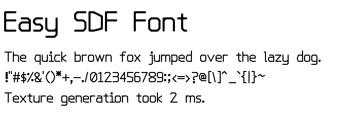

= easy-sdf-font
:notitle:
:sectnums:

A single-file small embeddable single-stroke font
for use with existing signed distance field (SDF) text rendering engines.

Only supports the 95 ASCII printable characters (space to tilde).

== Why?

I needed a small embeddable font for use as a debug/fallback font for SDF text rendering.

Truetype outline fonts were ruled out because SDF generation is very expensive for them
(around 5-9x slower compared to single-stroke fonts,
the pause becomes noticeable to the user with Javascript which runs around 3x slower compared to C).

SDF font atlas generation for single-stroke fonts, on the other hand,
is very cheap since the formula for the distance to a straight line is very simple.

On my system with `-O2`,
`easy-sdf-font.h` takes around 3ms for SDF generation,
whereas a truetype outline font (with stb_truetype) takes around 21ms.

== Usage

Two implementations are provided: `easy_sdf_font.h` (for C) and `easy_sdf_font.js` (for Javascript).

See the header comments of those files or `demo.c`/`demo.html` for information of how to use them.

.Screenshot of `demo.c` / `demo.html`

== License

Public domain.
